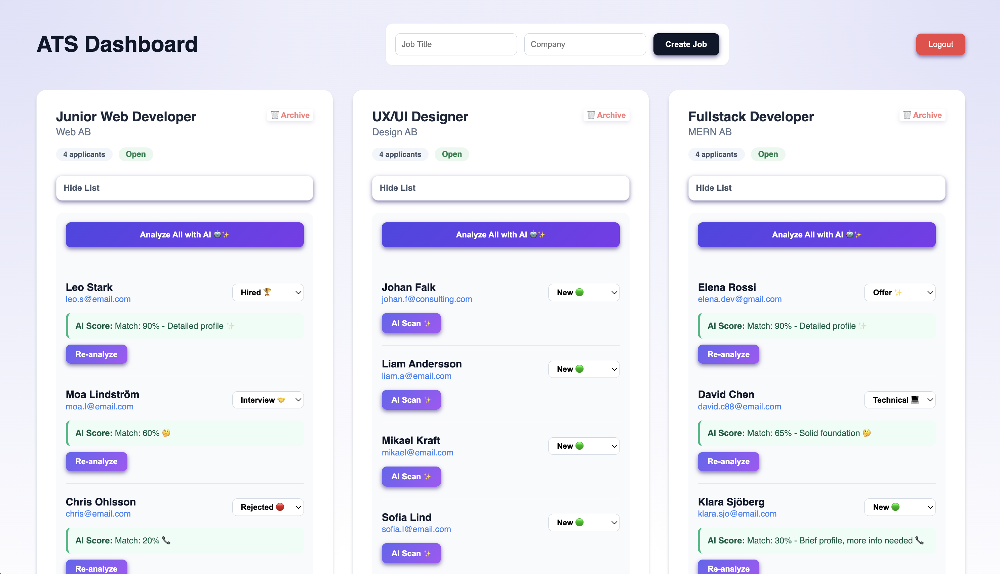
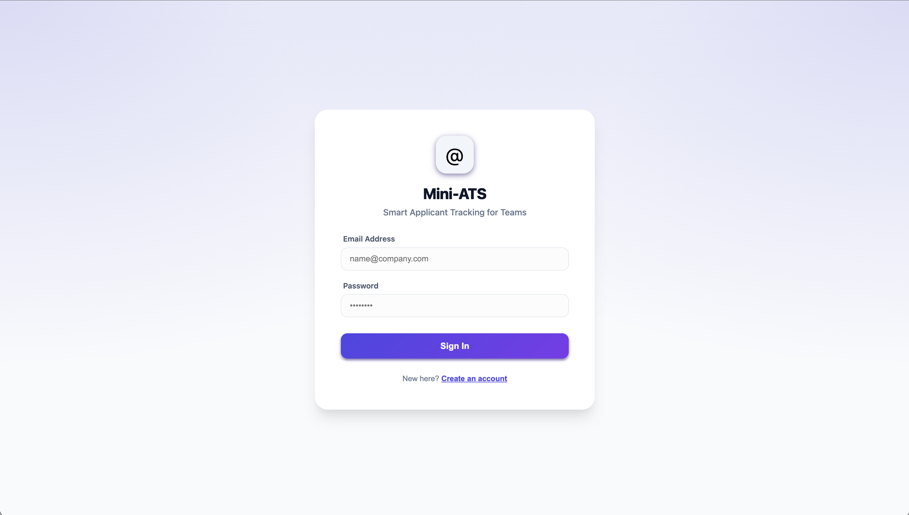
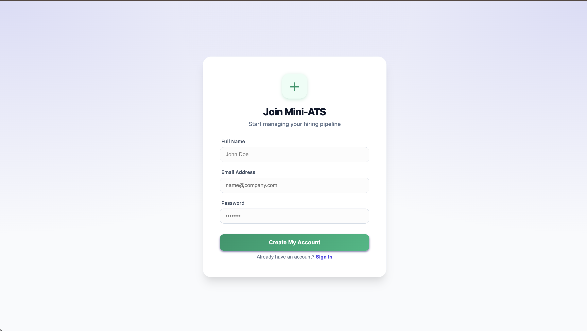
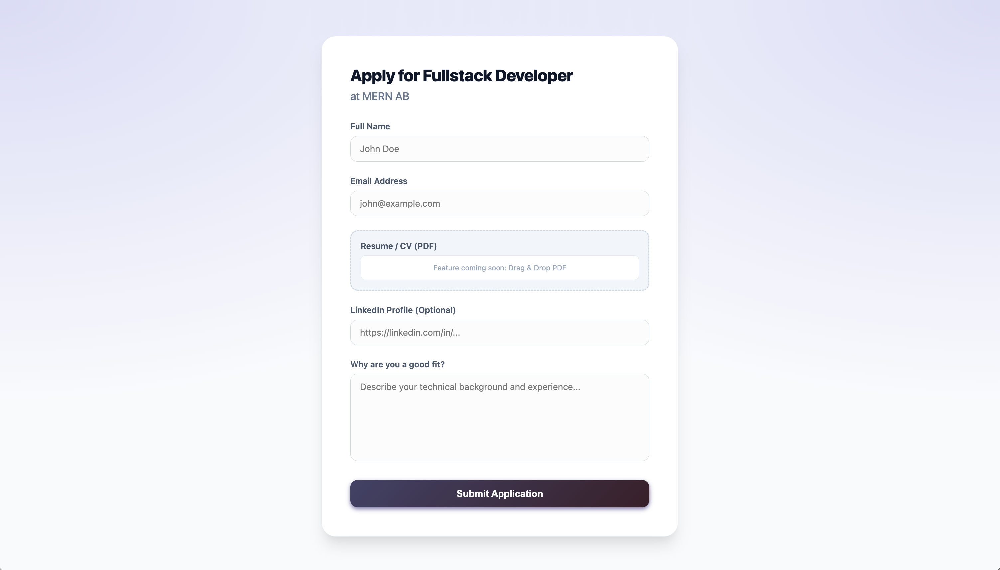

# 🤖 Mini-ATS: Smart Applicant Tracking System

**Mini-ATS** är en modern, fullstack-applikation byggd för att förenkla rekryteringsprocessen. Med fokus på snabbhet, AI-insikter och ett rent användargränssnitt hjälper den rekryterare att hantera jobbannonser och kandidater effektivt.

---

## 📸 Visual Overview

### 🏢 Recruiter Dashboard

Hantera dina jobbannonser och se kandidaternas framfart i realtid.


### 🔐 Secure Entry

Ett modernt gränssnitt för autentisering som skyddar din rekryteringsdata.


### 🔑 Authentication & Profiles

Implemented a secure login and registration flow using **Supabase Auth**.


### 📝 Candidate Experience

En ren och intuitiv ansökningssida designad för att maximera konverteringen av talanger.


## ✨ Key Features

- **🔒 Secure Authentication:** Fullt inloggningssystem via Supabase Auth för att skydda kunddata.
- **📊 Recruiter Dashboard:** Kraftfull överblick för att skapa, hantera och arkivera jobbannonser.
- **🤖 AI-Powered Analysis:** Simulerad AI-screening som poängsätter kandidater baserat på profilmatchning (stöder även bulk-analys).
- **📝 Public Job Portal:** En publik `/apply`-sida där kandidater enkelt kan skicka in sina ansökningar.
- **🛡️ Soft Delete Strategy:** Arkiveringsfunktion som döljer avslutade jobb men behåller värdefull historik i databasen.
- **💎 Premium UI/UX:** Responsiv design byggd med Inter-font, mjuka skuggor och ett intuitivt flöde.

---

## 🛠 Tech Stack

- **Frontend:** React.js (Vite)
- **Backend/Database:** Supabase (PostgreSQL)
- **Routing:** React Router v6
- **AI Logic:** Simulerad NLP-logik för kandidatbedömning.
- **Styling:** Modern CSS-in-JS med fokus på en ren och professionell estetik.

---

## 🚀 Getting Started

### Prerequisites

- Node.js installerat på din dator.
- Ett projekt uppsatt i Supabase.

### Installation

1.  Klona detta repository.
2.  Installera alla paket:
    ```bash
    npm install
    ```
3.  Konfigurera miljövariabler i en `.env`-fil:
    ```env
    VITE_SUPABASE_URL=din_supabase_url
    VITE_SUPABASE_ANON_KEY=din_supabase_anon_key
    ```
4.  Kör applikationen lokalt:
    ```bash
    npm run dev
    ```

---

## 🧠 Technical Reflections & Architecture

Projektet är byggt med **skalbarhet** i åtanke. Genom att använda `is_deleted`-flaggor istället för permanenta raderingar (Soft Delete) har jag skapat ett system som är redo för framtida data-analytics.

### ### Future Roadmap 🚀

- **📄 PDF-Parsing:** Integration med Supabase Storage för att läsa in och analysera riktiga CV-filer.
- **🔍 Advanced Filtering:** Möjlighet att filtrera kandidater på kompetens och erfarenhetsnivå.
- **📧 Automated Feedback:** Systemet skickar automatiskt svar till kandidater vid statusändringar.

---

## 👩🏻‍💻 Utvecklat av

**Manau Tunjae** – Fullstack Developer Student
_"En passion för att kombinera ren kod med användarvänliga AI-lösningar."_
